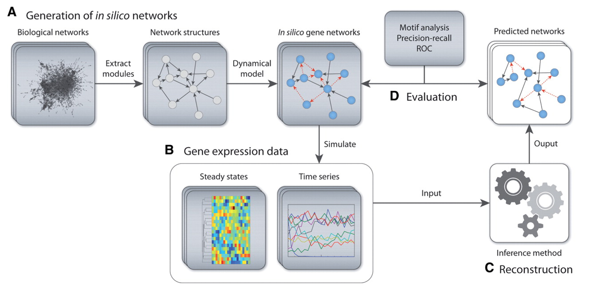

# Synthetic Data Model

We use the [`GeneNetWeaver`](https://pubmed.ncbi.nlm.nih.gov/21697125/) package to simulate synthetic data


**Figure 1**: GeneNetWeaver graphic from the original paper. We focus on package elements illustrated by section B. [source](https://academic.oup.com/bioinformatics/article/27/16/2263/254752).


To simulate data for initial model training and evaluation, we have extended the [`GeneNetWeaver`](https://pubmed.ncbi.nlm.nih.gov/21697125/) package [(1)](#references), which uses ordinary differential equations (ODEs) built from a gene regulatory network (GRN) to simulate bulk mRNA gene expression under a variety of conditions. GNW outputs include: 

1. cell line steady state gene expression in the absence of any perturbation and 
2. gene expression time series after the introduction of genetic or chemical perturbation. 

GNW uses ODEs of the form: 

$$ \frac{dx_i}{dt} = m_i f_i(y) - \lambda_i^{RNA}  x_i $$ 

$$ \frac{dy_i}{dt} = r_i x_i - \lambda_i^{PROT} y_i $$

Where $x_i$ is RNA gene expression. $y_i$ is protein abundance. $m_i$ and $r_i$ are production rates.$f_i(y)$ is a function of transcription factor activation and $\lambda$ represents respective degradation rates. Subscript $i$ represents the respective gene index. 

Building upon the GNW method, we simulate knockout’s (KO) by setting  to zero, knockdown’s (KD) by setting  to half its original value and over-expression (OE) by setting  to twice it’s original value. Chemical perturbations are simulated by randomly sampling a set of gene targets and respective dissociation constants and modifying the target gene values according to the equation: 

$$ m_i^{perturbed} = m_i \pm \frac{m_i}{1+\frac{k_d}{c}} $$

Where $k_d$ represents dissociation constant and c is concentration in micro-molars. We simulate multi-drug combinations by modifying the union of drug targets. Drug target collisions are handled by either... 

Same drug types (2-agent combination):
$$ m_i^{perturberd} = m \pm m_i * \frac{c_1}{c_1 + k_{d,1}(1 + \frac{c_2}{k_{d,2}})} $$ 

Different drug types (2-agent combination):
$$ m_i^{perturberd} = \frac{m_i^{agonist} + m_i^{inhibitor}}{2}  $$

We note the accepted scientific premise of pharmacological binding is that a drug binds to protein and stabilizes an active or inactive conformation. This premise suggests that a logical extension would be the modification of protein abundance  or transcription factor activation; However, in practice we find that our approach to drug simulation creates reasonable outputs and captures many aspects of true drug perturbation behavior. 
 
Different cell contexts (such as cell type, patient, disease, etc.) have varying GRNs, which result in unique expression steady states and perturbation response. To emulate this behavior, we simulate each cellular context by creating a similar - but distinct – GRN prior to GNW simulation. Cellular context GRNs are created by randomly removing a subset of edges from the original parent GRN. This modified GRN becomes input to the GNW simulation. 
 
This work provides a tool for simulating the LINCS L1000 datatypes. Importantly, the data produced by this method is mediated by an underlying GRN, which makes graph-based methods uniquely suited to modeling the data. 

# Generating Synthetic Data 

For a detailed walk-through of synthetic data pipeline, see `gnnCDR/examples/gnw_tutorial.ipynb` 

## Settings 

Modify the local `settings.txt` file, which *must* be stored in the `.../gnnCDR/gnn_cdr/gnw/gnw/settings.txt`

The relevant parameters to modify include... 

```bash
# ideal-waddle Relevant parameters

# Default max duration time in time-series experiments (must be consistent with numTimePoints_ and dt_)
maxtTimeSeries = 500

# Time step for the time series (numTimePoints_ = (int) Math.round(maxtTimeSeries/dt) + 1)
dt = 50

# Number of cell line models to create (n-1 single gene KO models + original)
n_cell_lines = 10

# probability of edge removal when making cell line models
prob_remove = 0.1

# Graph name to use as base PPI network # InSilicoSize100-Ecoli1.tsv
graph_name = InSilicoSize100-Ecoli1.tsv

# Number of agonist drugs to create 
num_agonists = 5

# Number of inhibitor drugs to create
num_inhibitors = 5

# minimum concentration to use for drug simulations, intended to be in units log10(uM)
min_log_conc = -5

# max conc """ 
max_log_conc = 1 

# number of concentrations to simulate, spread evenly from min_log_conc to max_log_conc on a log scale 
num_dose_pts = 5

# The expectation (mean) of the number of targets each drug has. Targets are assigned probabalistically so some will have more and some will have fewer.
expected_targs = 2

# minimum dissociation constant (kd) value to assign to drug targets (units of log(uM))
min_kd = -3

# max binding affinity 
max_kd = 0
```

## Usage 

To simulate data and produce the desired hdf5 file, first update the `settings.txt` file found in `gnn_cdr/gnw/gnw/` to reflect your desired parameters. Next, navigate to the `scripts` directory and run: 

```bash 
(gnnCDR) $ python create_synthetic_data.py --gnw_cwd ../gnn_cdr/gnw/gnw/ --out ../synthetic_data.h5
```

For command line options, use `--help`. 

## Output

The resulting `hdf5` file will have the following general structure: 

```bash
##################################################
Printing HDF5 output structure.
##################################################

baseline
         <HDF5 dataset "cell_lines": shape (25,), type "|S12">
         <HDF5 dataset "expr": shape (25, 100), type "<f8">
graphs
         PPI
                 <HDF5 dataset "edge_attr": shape (125, 2), type "<f8">
                 <HDF5 dataset "edge_index": shape (2, 125), type "<i4">
                 <HDF5 dataset "edge_labels": shape (2,), type "|O">
         PTI
                 <HDF5 dataset "binding_affinity": shape (120,), type "<f8">
                 <HDF5 dataset "edge_attr": shape (120, 5), type "<i8">
                 <HDF5 dataset "edge_index": shape (2, 120), type "<i8">
                 <HDF5 dataset "edge_labels": shape (5,), type "|O">
labels
         <HDF5 dataset "drug_names": shape (88,), type "|S11">
         <HDF5 dataset "gene_names": shape (100,), type "|S4">
meta
         cell_models
                 <HDF5 dataset "cell_line_0": shape (9, 2), type "|S3">
                 <HDF5 dataset "cell_line_1": shape (10, 2), type "|S3">
                 ...
                 <HDF5 dataset "cell_line_8": shape (7, 2), type "|S3">
                 <HDF5 dataset "cell_line_9": shape (5, 2), type "|S3">
         <HDF5 dataset "cell_models_info": shape (1,), type "|S54">
         <HDF5 dataset "creation_date": shape (), type "|O">
         edgelist
                 <HDF5 dataset "annot": shape (125,), type "|S1">
                 <HDF5 dataset "from": shape (125,), type "|S3">
                 <HDF5 dataset "to": shape (125,), type "|S4">
         <HDF5 dataset "settings": shape (), type "|O">
perts
         <HDF5 dataset "cell_line": shape (344850,), type "|S12">
         <HDF5 dataset "conc_um": shape (344850,), type "|S46">
         <HDF5 dataset "expr": shape (344850, 100), type "<f8">
         <HDF5 dataset "pert_kd": shape (344850,), type "|S260">
         <HDF5 dataset "pert_name": shape (344850,), type "|S24">
         <HDF5 dataset "pert_targ": shape (344850,), type "|S58">
         <HDF5 dataset "pert_type": shape (344850,), type "|S20">
         <HDF5 dataset "time": shape (344850,), type "<f8">
```

## Output PCA 


 
(left) Colored by `cell context` (middle) colored by perturbation type, filtered to genetic perturbations only. (right) colored by time.

# Generating synthetic data splits 

To create test/train/val splits, use the script: 

```bash 

python create_data_splits.py --data ../data/synthetic_data.h5 --out ../output/ --prop 0.7

```

See `$ python create_data_splits --help` for command line options.

# Creating train/test/val datasets 

The last step before we can move on to model training is to do the necessary pre-processing and create data splits. This can be done with: 

```bash 

$ python SynthDataPreprocessing.py --input ../data/synthetic_data.h5 --output ../data/synthetic_data_PREPROC.h5

```

See `$ python SynthDataPreprocessing.py` --help for command line options

This will produce a `.h5` file with the following structure: 

```
cell_model
         GRN_removed_edges
                 <HDF5 dataset "cell_line_0": shape (6, 2), type "|S3">
                 <HDF5 dataset "cell_line_1": shape (9, 2), type "|S3">
                 <HDF5 dataset "cell_line_2": shape (8, 2), type "|S3">
                 <HDF5 dataset "cell_line_3": shape (5, 2), type "|S3">
                 <HDF5 dataset "cell_line_4": shape (12, 2), type "|S3">
                 <HDF5 dataset "cell_line_5": shape (10, 2), type "|S3">
                 <HDF5 dataset "cell_line_6": shape (5, 2), type "|S3">
                 <HDF5 dataset "cell_line_7": shape (10, 2), type "|S3">
                 <HDF5 dataset "cell_line_8": shape (6, 2), type "|S3">
         <HDF5 dataset "labels": shape (10,), type "|S11">
         <HDF5 dataset "onehot": shape (137940, 10), type "<f4">
global_graph
         KD
                 <HDF5 dataset "node_names": shape (26,), type "|S6">
                 targets
                         protein
                                 <HDF5 dataset "edge_index": shape (2, 26), type "<i8">
         KO
                 <HDF5 dataset "node_names": shape (26,), type "|S6">
                 targets
                         protein
                                 <HDF5 dataset "edge_index": shape (2, 26), type "<i8">
         OE
                 <HDF5 dataset "node_names": shape (26,), type "|S6">
                 targets
                         protein
                                 <HDF5 dataset "edge_index": shape (2, 26), type "<i8">
         agonist
                 <HDF5 dataset "node_names": shape (5,), type "|S9">
                 targets
                         protein
                                 <HDF5 dataset "edge_index": shape (2, 7), type "<i8">
         inhibitor
                 <HDF5 dataset "node_names": shape (5,), type "|S11">
                 targets
                         protein
                                 <HDF5 dataset "edge_index": shape (2, 18), type "<i8">
         protein
                 activates
                         protein
                                 <HDF5 dataset "edge_index": shape (2, 66), type "<i8">
                 inhibits
                         protein
                                 <HDF5 dataset "edge_index": shape (2, 59), type "<i8">
                 <HDF5 dataset "node_names": shape (100,), type "|S4">
pert
         <HDF5 dataset "conc_um": shape (137940,), type "|S46">
         <HDF5 dataset "pert_name": shape (137940,), type "|S24">
         <HDF5 dataset "pert_type": shape (137940,), type "|S20">
protein
         <HDF5 dataset "x": shape (137940, 100), type "<f8">
         <HDF5 dataset "y": shape (137940, 100), type "<f8">
time
         <HDF5 dataset "max_time": shape (), type "<f8">
         <HDF5 dataset "time": shape (137940,), type "<f8">
```


# References 

1. Schaffter T, Marbach D, Floreano D. GeneNetWeaver: in silico benchmark generation and performance profiling of network inference methods. Bioinformatics. 2011 Aug 15;27(16):2263-70. doi: 10.1093/bioinformatics/btr373. Epub 2011 Jun 22. PMID: 21697125.