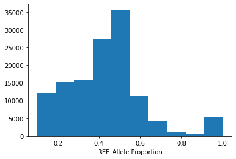

# Encoding Options 

First 5 rows of our pandas dataframe. 

```
ensembl	        cell_iname	    Variant_Classification	Variant_Type	Variant_annotation	isDeleterious
ENSG00000008128	    HL60	    Missense_Mutation	    SNP	            other non-conserving	False
ENSG00000142611	    HL60	    Missense_Mutation	    SNP	            other non-conserving	False
ENSG00000179163	    HL60	    Missense_Mutation	    SNP	            other non-conserving	False
ENSG00000126705	    HL60	    Missense_Mutation	    SNP	            other non-conserving	False
ENSG00000162526	    HL60	    Silent	                SNP	            silent	                False
```


## Feature: `CGA_WES_AC`

> For all columns with AC, the allelic ratio is presented as [ALTERNATE:REFERENCE].

CGA_WES_AC: the allelic ratio for this variant in all our WES/WGS(exon only) using a cell line adapted version of the 2019 CGA pipeline that includes germline filtering. [source](https://depmap.org/portal/download/?releasename=DepMap+Public+22Q1&filename=CCLE_mutations.csv).

22% of observations have NA values for this feature. 



## Feature: `Variant_Classification` 

> Translational effect of variant allele [source](https://docs.gdc.cancer.gov/Data/File_Formats/MAF_Format/)

```
Variant_Classification	        count
Missense_Mutation	            123884
Silent	                        53541
Frame_Shift_Del	                11449
Splice_Site	                    8215
Nonsense_Mutation	            7608
Frame_Shift_Ins	                5298
In_Frame_Del	                1014
De_novo_Start_OutOfFrame	    826
In_Frame_Ins	                224
Start_Codon_SNP	                196
Nonstop_Mutation	            149
Intron	                        116
IGR	                            39
Stop_Codon_Del	                34
Stop_Codon_Ins	                22
5'Flank	                        19
Start_Codon_Del	                17
5'UTR                       	13
3'UTR	                        13
Start_Codon_Ins         	    9
```

## Feature: `Variant_annotation`

> No Depmap information available on this feature. 

[This](https://www.biostars.org/p/9481609/) biostars thread offers some insight: 

> [**A. Domingues**] "Got the answer in the Forum of DepMap (closed access). I am pasting here the crucial part of the answer. If any one from DepMap has an issue with it, I am happy to remove it:

>> *We use Oncotator to annotate the mutations. The output of this tool is stored in the ‘Variant_Classification’ column of the mutation maf file The Variant_annotation column in the CCLE_mutations.csv MAF file*

>> *We have added a Variant_annotation column in the DepMap mutation data, CCLE_mutations.csv 4, which groups mutations using more inclusive definitions. The Variant_annotation column labels a mutation as “damaging”, “other non-conserving”, “other conserving” or “silent” using the Variant_Classification column and the definitions below."*

`Oncotator` information [here](https://software.broadinstitute.org/cancer/cga/oncotator).

```
Variation               count
other non-conserving	125327
silent	                53541
damaging	            33618
other conserving	    200
```

## Feature: `Variant_Type`

> Type of mutation. TNP (tri-nucleotide polymorphism) is analogous to DNP (di-nucleotide polymorphism) but for three consecutive nucleotides. ONP (oligo-nucleotide polymorphism) is analogous to TNP but for consecutive runs of four or more (SNP, DNP, TNP, ONP, INS, DEL, or Consolidated) [source](https://docs.gdc.cancer.gov/Data/File_Formats/MAF_Format/)

```
Variant_Type	count
SNP	            193588
DEL	            13119
INS	            5907
DNP	            72
```

## Feature: `isDeleterious`

> No DepMap information available on this feature

This appears to be outdated, and "Variant_annotation" is suggested for replacement information. See this [thread](https://forum.depmap.org/t/how-is-the-isdeleterious-column-in-the-ccle-mutations-csv-file-determined/129). 

```
isDeleterious	count
0	False	178872
1	True	33814
```