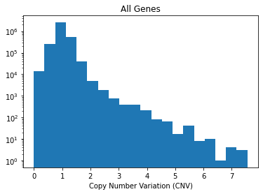

# Copy Number Variation (CNV)

Gene-level copy number data that is log2 transformed with a pseudo-count of 1; log2(CN ratio + 1). 

```
Genes:25368
Cell Lines:1754
Primary Diseases:35
Lineages:38
Source: Broad Institute
```

DepMap [readme](https://depmap.org/portal/download/?releasename=DepMap+Public+22Q1&filename=CCLE_gene_cn.csv).

# Reactome FI coverage 

```
# cnv genes: 24004
# FI genes: 13609
# CNV,FI genes that overlap: 13407 [98.5%]
```

# Cell line coverage 

There are 132 cell lines with `DepMap_ID -> cell_iname` mappings that also have coverage in i) `Lincs` ii) `CCLE expr` and iii) `CCLE mutation`.

NOTE: Previous CCLE & Lincs cell line overlap was 133 but cell line (`cell_iname`) `HCC1588` is not in the CNV dataset. 

Fortunately, `HCC1588` only has 308 observations in LINCS (after QC), and therefore we feel comfortable dropping this line from our analysis.

To see this list of overlapping lines, refer to: 
`gnnCDR/gnn_cdr/depmap/eda/lincs_expr_mut_cnv_cell_inames.txt`

# Missing CNV values 

There are a small subset (~0.001%) of NA values in this dataset. `NA` elements are assigned a value of 1. 

# CNV historgam 

 

# Pre-processing CNV data 

Genes in the reactome FI network that are not in the `CNV` dataset are assigned a value of 1. 

All CNV values are then scaled between 0-1. 

# Implementation 

To load the data: 

```python 
cnv = gnn_cdr.depmap.load_ccle_cnv(verbose=True)
```

output: 

```
# of genes lost in XXX -> ensembl mapping (columns): 1420
# of cell lines lost cin DepMap_ID -> cell_iname mapping (rows): 1618
[Final] Number of genes: 24004
[Final] Number of cell lines: 136
```

To get an individual cell lines CNV data: 

```python 
max_cnv_val = cnv[cnv.columns[1:]].values.ravel().max()
x = gnn_cdr.depmap.get_cell_line_ccle_cnv(cnv, cell_line='HEPG2', genelist=nodelist_fi, max_cnv_val=max_cnv_val)
x.shape
```

output: 

```
(13639,)
```