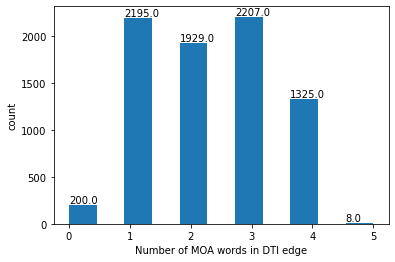

# Drug-Target Interaction Graph 

To map drug effect to protein targets we will use the CLUE compound datasets. 

Data [source](https://s3.amazonaws.com/macchiato.clue.io/builds/LINCS2020/compoundinfo_beta.txt), More information can be found [here](https://clue.io/repurposing). 

This is a bi-partite graph, which maps `drug` nodes to `protein` nodes. 

After filtering to drug targets contained in the reactome FI network, we calculate the general characteristics: 

```
min # targs 1
max # targs 96
median # targs 1.0
mean # targs 2.5294306851077515
```

# Edge Annotation Feature Encoding 

Similar to edge annotation encoding used for the FI network, we will use word presence to encode drug mechanism of action (MOA). 

Here are the top 10 most frequent MOA words. 

```
MOA WORD            # DRUGS W/ MOA WORD
---------------------------------------
inhibitor             1903
receptor              1434
antagonist            792
agonist               650
serotonin             176
channel               161
kinase                152
adrenergic            148
dopamine              133
blocker               123
```

The full list of drug MOA words and there respective count (by drug) can be found [here](./moa_word_counts_by_drug.txt). 

We will use the top N [???] most common MOA words as DTI edge features; Recognizably, this may lead to some drugs having *no* word presence (e.g., zero vector edge features) and therefore we should be cognizant of the convolution type that we use such that zero vectored edge features will still be capable of learning a pertubation effect. Using the top 50 most common MOA words, we can create `edge_attr` vector with binary label counts: 



This graph shows that (using top 50 most common MOA words) we will have 200 "zero-vectored" edges, e.g., edges that have *no* MOA word presence. 


# Implementation 

```python

edge_index, edge_attr, drug_nodelist, moa_words = gnn_cdr.lincs.create_CLUE_dti_graph(fi_nodelist, n_moa_feats=50)

```

output: 

```
# na targets: 31275
# of targets without ensemble protein id: 1
# of targets not in id list: 181
[FINAL] # of targets,drugs: (7864, 3109)
```

