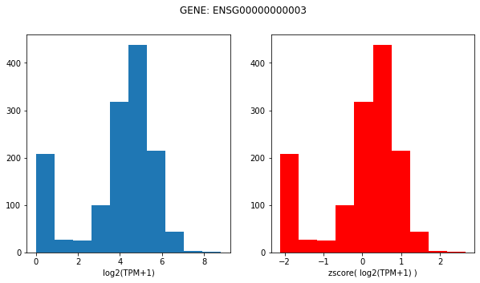

# Cancer Cell Line Encyclopedia unperturbed RNA-seq expression 

## Data source and info

We will use the CCLE expression dataset, which can be downloaded [here](https://ndownloader.figshare.com/files/34008404), more info [here](https://depmap.org/portal/download/). 

```
From DepMap: 

Gene expression TPM values of the protein coding genes for DepMap cell lines. Values are inferred from RNA-seq data using the RSEM tool and are reported after log2 transformation, using a pseudo-count of 1; log2(TPM+1).

Additional RNA-seq-based expression measurements are available for download as part of the full DepMap Data Release

More information on the DepMap Omics processing pipeline is available at https://github.com/broadinstitute/depmap_omics.


Genes:19177
Cell Lines:1393
Primary Diseases:33
Lineages:38
Source: Broad Institute
```

## Reactome FI Coverage

There are `403` ccle gene's lost in the mapping from gene symbol to ensembl. 

13373 of 13609 reactome FI genes have coverage in CCLE expression dataset (98% coverage). 

## LINCS Coverage 

Of the total cell lines in LINCS (n=239), 133 of them have CCLE expression data (56%); However, these 133 lines make up the majority of observations in LINCS L1000. After filtering observations that did not pass QC, these 133 lines with CCLE expression coverage made up 1.83/2.16 million LINCS observations (85%). 

## Z-score transformation 

To make imputation and gene-to-gene expression more comparable for our GNN we will perform z-score tranformations: 

$$ zscore(x) = \frac{x - \bar{x}}{\sigma^2} $$ 

Here is a visualization of the original and transformed distributions: 



This can be done using the function: 

```python 
expr = gnn_cdr.depmap.load_ccle_expr(zscore=True)
```

## Accessing individual cell line expression 

We can get a specific cell lines expression by using the method: 

```python 
x = gnn_cdr.depmap.get_cell_line_ccle_expr(expr, cell_line, genelist)
``` 

where: 

- `expr` is the pandas dataframe returned by `load_ccle_expr`
- `cell_line` is the cell_iname identifier 
- `genelist` is the list of genes to return; note, genes that are in genelist but not in expr will be *zero* imputed. 

