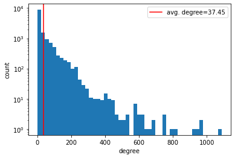
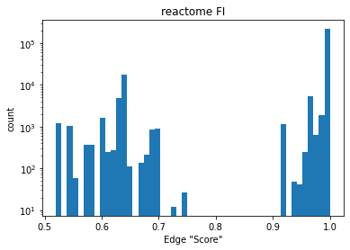

# Creating a Global Graph using the Reactome Functional Interaction (FI) network 

We will create a `global graph` (e.g., a graph spanning all protein/gene entities; used as parent for individual perturbation subgraphs) using the functional interaction (FI) network provided by (1). The FI network provided by Wu et. al, aims at constructing a pathway-based analysis system. To do this they:   

> "Construct a protein functional interaction network by extending curated pathways with non-curated sources of information, including protein-protein interactions, gene coexpression, protein domain interaction, Gene Ontology (GO) annotations and text-mined protein interactions, which cover close to 50% of the human proteome" (1).

More recent database updates have been provided, which has improved the proteome coverage. The data and information can be found [here](https://reactome.org/download-data). We plan to use the most recent version, as of 3/8/22 we are using `Version 2021`. 

For this network, we make the assumption that each `gene` -> `rna` -> `protein` maps 1:1:1 and therefore we can collapse genes, rna and protein into a single node, which represents the state of all 3. Furthermore, this allows complex edge interactions beyond merely protein-protein interactions or gene regulatory information. 

# Data Format 

The reactome FI data is provided in the form of edge list with features:

- Annotation: The edge type(s) 
- Direction: The edge direction [-,|,<,>]
- Score: Edge confidence, only applicable if the edge is predicted. 

```
Gene1	Gene2	Annotation	                    Direction	Score	Gene1_ensembl	Gene2_ensembl
16-5-5	CDC42	predicted	                    -	        0.97	None	        ENSG00000070831
16-5-5	PARD3	predicted	                    -	        1.00	None	        ENSG00000148498
16-5-5	PARD3B	predicted	                    -	        1.00	None	        ENSG00000116117
A1CF	APOBEC1	catalyzed by; complex; input	<-	        1.00	ENSG00000148584	ENSG00000111701
A1CF	EP300	expression regulated by	        <-	        1.00	ENSG00000148584	ENSG00000100393
```

Top 10 most common edge annotations and directions. As you can see, the edge annotation can include multiple labels. 

```
Annotation	                            Direction	    Count
--------------------------------------------------------------
complex; input	                            -	        64959
predicted	                                -	        40443
complex	                                    -	        17248
catalyzed by	                            <-	        11145
catalyze	                                ->	        9563
input	                                    -	        8240
catalyze; catalyzed by; complex; input	    <->	        7707
activate	                                ->	        5658
activated by	                            <-	        5558
catalyze; catalyzed by; input	            <->	        5476
```


# Network Characteristics 

**NOTE**: We filter to the largest connected component. 

```
Number of Nodes:        13751
Number of Edges:        257629
Average Cluster Coef:   0.38
Network Density:        0.003
```





# Overlap with LINCS L1000 platform 

Data [source](https://s3.amazonaws.com/macchiato.clue.io/builds/LINCS2020/instinfo_beta.txt)

NOTE: for this EDA we use the largest component. 

To understand the overlap between L1000 genes and Reactome FI entities, we map the overlapping sets and compare. The L1000 dataset has 3 data subsets: 
> **landmark**: ~1000 genes RNA abundance explictly measured using a Luminex bead assay, more info [here](https://lincsproject.org/LINCS/tools/workflows/find-the-best-place-to-obtain-the-lincs-l1000-data).   

> **inferred**: ~2000 genes with inferred RNA abundance, but not apart of the `best inferred` subset. Lower accuracy estimates.   

> **best infered**: ~9000 genes with high confidence inferred RNA abundance.   


To map genes between `reactome FI` and `LINCS L1000` genes, we use ensembl gene identifiers - which does not have perfect mapping (e.g., we lose some genes in mapping from XXX -> enesmbl).

```

############ landmark #############
# of lincs genes dropped in ensembl mapping: 10
# of reactome genes dropped in ensembl mapping: 344
# lincs genes: 968
# reactome genes: 13609
# overlapping genes (lincs & reactome) 837
	 percentage of reactome:  6.2
	 percentage of lincs:     86.5

############ best inferred #############
# of lincs genes dropped in ensembl mapping: 129
# of reactome genes dropped in ensembl mapping: 344
# lincs genes: 9067
# reactome genes: 13609
# overlapping genes (lincs & reactome) 7394
	 percentage of reactome:  54.3
	 percentage of lincs:     81.5

############ all #############
# of lincs genes dropped in ensembl mapping: 187
# of reactome genes dropped in ensembl mapping: 344
# lincs genes: 12140
# reactome genes: 13609
# overlapping genes (lincs & reactome) 9808
	 percentage of reactome:  72.1
	 percentage of lincs:     80.8
```

# Overlap with CLUE compound information 

Data [source](https://s3.amazonaws.com/macchiato.clue.io/builds/LINCS2020/compoundinfo_beta.txt), More information can be found [here](https://clue.io/repurposing). 

To ensure that we have drug -> protein overlap in our reactome FI graph we convert all protein targets from the CLUE compound information dataset to ensembl genes and compare the overlap in reactome FI network. 

```
# NA target observations (filtered): 		31275
# of targets without ensembl id: 			1
# of targets not in reactome FI network: 	181
# of targets in reactome FI network: 		7864
# of drugs in reactome FI network: 			3109
# of unique drugs targets in FI network: 	836 
```

Of note, `cmap_name` is not a 1:1 mapping with `pert_id`. 

# Edge Annotation Feature Encoding 

Word annotation features are encoded as binary variable word presences, e.g., if a word is present in the annotation, then that label has a 1 value, otherwise 0. 

NOTE: this is "hot-encoding" but not "one-hot encoding"; edges can have multiple annotations.

example:
```
edge annotation: 	"catalyzed by; complex; input"  
annot. word list: 	['catalyzed', 'complex', 'input', 'random']   
edge feature: 		[1,1,1,0] 
```

See below a the edge annotation word list and respective word frequencies across all edges in the FI network. 

```
word label -------------------- Frequency % (across all edges)
__________________________________________________________
methylation ------------------- 0.0019
glycosylation ----------------- 0.0037
glycosylated ------------------ 0.0044
dephosphorylated -------------- 0.0063
state ------------------------- 0.0102
change ------------------------ 0.0102
repression -------------------- 0.0183
repressed --------------------- 0.0197
ubiquitinated ----------------- 0.0348
interaction ------------------- 0.0565
dissociation ------------------ 0.0655
ubiquitination ---------------- 0.0911
PCrel ------------------------- 0.2602
dephosphorylation ------------- 0.3221
phosphorylated ---------------- 0.5218
inhibition -------------------- 0.9153
ECrel ------------------------- 0.9411
effect ------------------------ 1.0804
indirect ---------------------- 1.0912
GErel ------------------------- 1.1847
compound ---------------------- 1.2137
regulates --------------------- 1.3004
regulated --------------------- 1.4183
phosphorylation --------------- 1.6001
binding/association ----------- 2.4961
inhibited --------------------- 2.8101
activation -------------------- 2.8267
reaction ---------------------- 3.4820
inhibite ---------------------- 3.4847
expression -------------------- 3.7661
inhibit ----------------------- 4.9503
activated --------------------- 5.7617
activate ---------------------- 8.9841
PPrel ------------------------- 10.2082
catalyzed --------------------- 10.3590
catalyze ---------------------- 14.3489
predicted --------------------- 19.7095
input ------------------------- 47.3727
complex ----------------------- 49.8622
```

# Edge Direction Encoding 

Our network is set up as a directed network and edge directionality is intended to be primarily specified by this mechanism. For bi-directional edges ('-' or '<->'), two opposing edges are included in our network. For some more complex edge annotations and directions (e.g., multiple edge annotations or alternate-type bi-directionality), encoding edge direction may be a useful feature. To do this, we will create 2 features that can have the possible values [-1,0,1]. 

Edge directions can be though of as 3 element string: 

> `left_char`, `center_char`, `right_char` 

`center_char` is always '-' and therefore unnecessary to encode   
`left_char` can be "|" (-1) or "<" (1) or neither (0), this will be the first feature   
`right_char` can be "|" (-1) or ">" (1) or neither (0), this will be the second feature   

The `edge direction` strings used in reactome FI network. 

```
Direction   |       Count   |   feature
---------------------------------------
-	        |      144182	|	[0,0]
<-	        |      40858	|	[1,0]
->	        |      39438	| 	[0,1]
<->	        |      13177	| 	[1,1]
|-	        |      5499		| 	[-1,0]
-|	        |      4690		| 	[0,-1]
|->	        |      1454		|	[-1,1]
<-|	        |      1107		|	[1,-1]
|-|	        |      79		|	[-1,-1]

```

# Implementation 

The reactome FI network can be constructed by: 

```python
edge_index, edge_attr, nodelist, annot_words = gnn_cdr.reactomefi.create_reactome_fi_graph()
```

# References 

1. Wu, G., Feng, X. & Stein, L. A human functional protein interaction network and its application to cancer data analysis. Genome Biol 11, R53 (2010). https://doi.org/10.1186/gb-2010-11-5-r53