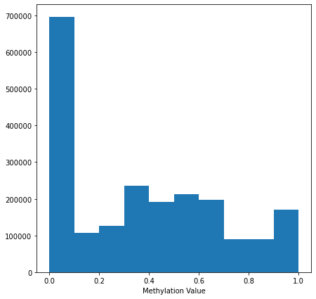

# Methylation 


## Data source and info 

Provided from `CCLE 2019` release of [CCLE DNA methylation data (promoter CpG clusters)](https://depmap.org/portal/download/all/?releasename=CCLE+2019&filename=CCLE_RRBS_tss_CpG_clusters_20181022.txt.gz). 

Citation: 

1. Mahmoud Ghandi, Franklin W. Huang, Judit Jané-Valbuena, Gregory V. Kryukov, ... Todd R. Golub, Levi A. Garraway & William R. Sellers. 2019. Next-generation characterization of the Cancer Cell Line Encyclopedia. Nature 569, 503–508 (2019). 

> "RRBS: For 843 cell lines, the RRBS method was used as previously described in [2]" 

2. Boyle, P. et al. Gel-free multiplexed reduced representation bisulfite sequencing for large-scale DNA methylation profiling. Genome Biol. 13, R92 (2012).

## Reactome FI Coverage 

11300 / 13609 (83%) of the reactome FI genes have methylation values. 

## LINCS Coverage 

Of all the cell lines in LINCS, and within those lines that also have coverage in `CNV`, `Expression` and `Mutation`, there are **115** cell lines that also have methylation coverage. 

## Methylation distribution 

Methylation values range from [0,1]. 



## Cross-gene aggregation and mean-imputation 

The dataset provided by [1] (downloaded through DepMap) contains multiple CpG sites per Gene. We first convert to ensembl ID's (as some genes map to the same ensembl ID), and then aggregate the average methylation value for each ensembl gene identifier. After this step, ~1.5% of values were `NA`. 

NA values are imputed by filling with the mean methylation value (~0.35). 

## Accessing individual cell line methylation 

We can get a specific cell line's methylation by using the method:

```
x = gnn_cdr.depmap.get_cell_line_ccle_methyl(methyl, cell_line, genelist, impute_val)
``` 

where:

- `methyl` is the pandas dataframe returned by `load_ccle_methyl()`.
- `cell_line` is the cell_iname identifier
- `genelist` is the list of genes to return; note, genes that are in genelist but not in expr will be imputed by `impute_val`. 
- `impute_val` will be used to fill missing genes methylation value. 