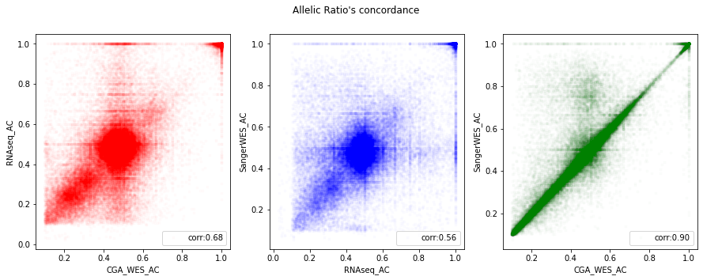
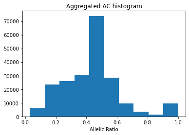
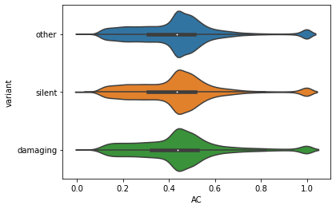

# Cancer Cell Line Encyclopedia Mutation Characterization 

## DepMap Readme 

```
Genes:18784
Cell Lines:1759
Primary Diseases:35
Lineages:38
Source: Broad Institute
```

DepMap [Info](https://depmap.org/portal/download/?releasename=DepMap+Public+22Q1&filename=CCLE_mutations.csv)
Release [README](https://depmap.org/portal/download/?releasename=DepMap+Public+22Q1&filename=README.txt)


# LINCS Coverage 

```
original # obs: 1269999
# obs lost converting to ensembl id: 62221
# of obs lost converting to cell_iname: 995092
final # obs: 212686
```

Of the total cell lines in LINCS (n=239), 138 of them have CCLE expression data including the same 133 that have CCLE expression data. 

# Reactome FI Coverage

After we map the `212,686` mutations (from above), to the covered Reactome FI gene nodes we have a `164,886` remaining mutations (78%).  

# Encoding 

We will focus on two features of this dataset: `Variant Annotation` and `Allelic Ratio` (AC). 


## Feature encoding: `Allelic Ratio` 

There are several options to use for allelic ratio, all specified with a `_AC` suffix. Due to missingness in the data, we will aggregate info from 3 sources (in order of confidence): 

> **CGA_WES_AC**: the allelic ratio for this variant in all our WES/WGS(exon only) using a cell line adapted version of the 2019 CGA pipeline that includes germline filtering.

> **RNAseq_AC**: in Broad RNAseq data from the CCLE2 project (legacy)

> **SangerWES_AC**: in Sanger WES (called by sanger) (legacy)

Our primary `AC` source (CGA_WES_AC) has ~22% missingness. All `AC` values are recorded as *strings* in the form `ALTERNATE:REFERENCE`, which we transform into a ratio using the function: 

$$ AC_R = \frac{ALTERNATE}{ALTERNATE + REFERENCE} $$

To ensure that these datatypes are concordant and interchangable, see the figure below for correlation of AC values. 



We then aggregate AC values using the logic: 

>> `AC` is equal to `CGA_WES_AC` if it's not Nan  
>> otherwise equal to `RNAseq_AC` if it's not Nan  
>> otherwise equal to `SangerWES_AC` if it's not Nan   
>> otherwise equal to `mean` of all `CGA_WES_AC` values (~0.5)   

Final `AC` distribution can be seen in the figure below. 



## Feature Encoding: `Variant Annotation` 

Feature name: `Variant_annotation` 

There was no Depmap information available on this feature; however, I was able to find some insight from a [biostars](https://www.biostars.org/p/9481609/) thread:  

> [**A. Domingues**] "Got the answer in the Forum of DepMap (closed access). I am pasting here the crucial part of the answer. If any one from DepMap has an issue with it, I am happy to remove it:

>> *We use Oncotator to annotate the mutations. The output of this tool is stored in the ‘Variant_Classification’ column of the mutation maf file The Variant_annotation column in the CCLE_mutations.csv MAF file*

>> *We have added a Variant_annotation column in the DepMap mutation data, CCLE_mutations.csv 4, which groups mutations using more inclusive definitions. The Variant_annotation column labels a mutation as “damaging”, “other non-conserving”, “other conserving” or “silent” using the Variant_Classification column and the definitions below."*

`Oncotator` information [here](https://software.broadinstitute.org/cancer/cga/oncotator).

This feature has 4 categories as seen in the table below. 

```
Category                count
------------------------------
other non-conserving	125327
silent	                53541
damaging	            33618
other conserving	    200
```

Since the category `other conserving` has relatively few observations associated with it, we will merge it with `other non-conserving` and relabel them as `other`. 

The final 3 categroical labels will be: 

```
Category        	    count
------------------------------
other	                125527
silent	                53541
damaging	            33618
```

These labels will then be *one-hot encoded*. The final output for this datatype will be a 4 dimensional feature for each gene in our network, which will be *zero* if a given cell line does not have mutation in that gene, otherwise: 

>> ```mut_features = [other_bool, silent_bool, damaging_bool, AC]```

Where `_bool` indicates binary values. `AC` will be a float between 0-1. 

# `Variant Annotation` vs `Allelic Ratio` 

To double check that we're not encoding redundant information, we checked the distribution of `AC` values for each variant annotation, see figure below. 



# Implementation 

```python
mut = gnn_cdr.depmap.load_ccle_mut()
```

mut dataframe head: 

```
ensembl	            cell_iname	    variant	    AC
--------------------------------------------------------
ENSG00000008128	    HL60	        other	    0.237762
ENSG00000142611	    HL60	        other	    0.531646
ENSG00000179163	    HL60	        other	    0.454545
ENSG00000126705	    HL60	        other	    0.512195
ENSG00000162526	    HL60	        silent	    0.440860
```

To get an individual `cell line's` mutation features: 

```python 
obs = gnn_cdr.depmap.get_cell_line_ccle_mut(mut, cell_line='HL60', genelist=nodelist_fi, variant_encoding=['other', 'silent', 'damaging'])
shape(obs)
```

output: 

```
(13609, 4)
```


# References 

1. DepMap, Broad (2022): DepMap 22Q1 Public. figshare. Dataset. https://doi.org/10.6084/m9.figshare.19139906.v1

2. Mahmoud Ghandi, Franklin W. Huang, Judit Jané-Valbuena, Gregory V. Kryukov, ... Todd R. Golub, Levi A. Garraway & William R. Sellers. 2019. Next-generation characterization of the Cancer Cell Line Encyclopedia. Nature 569, 503-508 (2019).