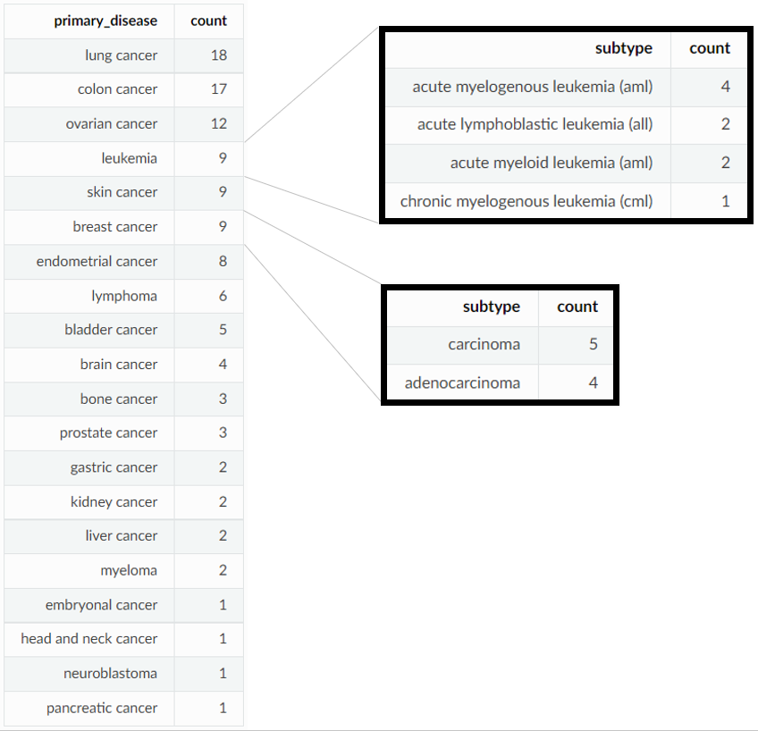
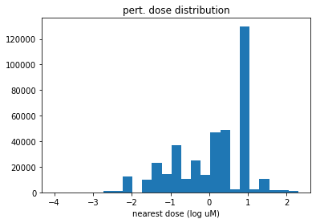
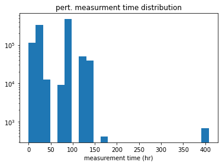
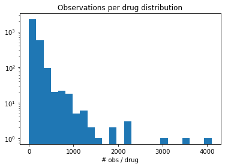
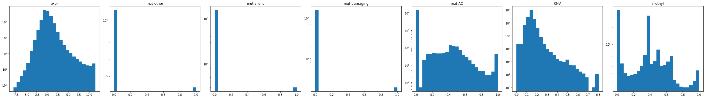
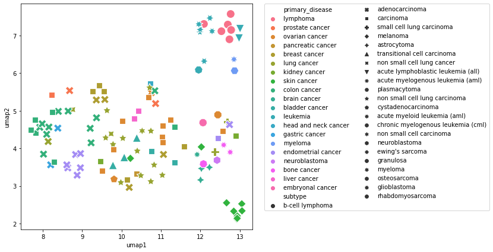
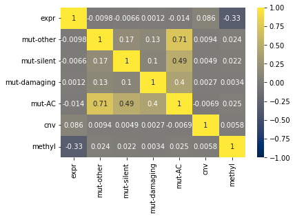
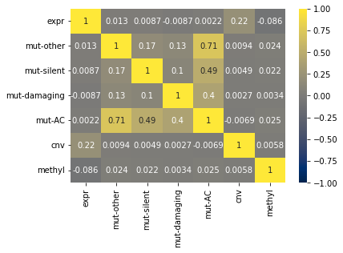

# Exogenous data overview 

Protein node exogenous features will include: 

1. mRNA expression from [Depmap](https://depmap.org/portal/download/?releasename=DepMap+Public+22Q1&filename=CCLE_expression.csv)

2. Mutation data from [Depmap](https://depmap.org/portal/download/?releasename=DepMap+Public+22Q1&filename=CCLE_mutations.csv)

3. Copy Number Variation (CNV) from [Depmap](https://depmap.org/portal/download/?releasename=DepMap+Public+22Q1&filename=CCLE_gene_cn.csv)

4. RRBS promoter (1kb upstream TSS) methylation from [Depmap](https://depmap.org/portal/download/?releasename=CCLE+2019&filename=CCLE_RRBS_TSS1kb_20181022.txt.gz)

5. TODO: LINCS L1000 controls data --- **add description** 

## Cell lines with lincs + depmap coverage

There are `115` cell lines that have coverage in both LINCS and the 4 depmap datatypes listed above. 

## LINCS coverage 

Note: These are rough estimates, and may not reflect the exact number of final observations. 

After filtering observations that did not pass QC and within our usable subset of `115` cell lines and `3109` drugs, we can filter the LINCS level 3b dataset and find that we have `1036861` (34% of all LINCS) observations. This includes multiple perturbation types, doses and measurement times. See the break down below: 

|  `pert_type`| `count`   |  
|  -------    |---------  |    
| trt_cp      |    393874 |  
| trt_xpr     |    256809 |  
| trt_sh      |    212126 |  
| trt_oe      |    57289  |  
| ctl_vehicle |    49003  |  
| ctl_vector  |    33623  |  
| ctl_untrt   |    17319  |  
| trt_lig     |    15273  |  
| trt_aby     |    1093   |  
| trt_si      |    452    |  

The dosage and time distributions for our usable set of observations can be seen below: 

Of the drugs in our drug-target-interaction (DTI) graph, `106/3109` do not have *any* LINCS observations. The number of observations per drug can be seen in the histogram below: 

## Depmap Exog. Exploratory Data Analysis 

The distributions of the 4 depmap datatypes can be seen here: 

Using the 4 depmap datatypes (expr, mut, cnv, methyl), a umap representation shows strong clustering by `primary disease` and `subtype` 

We can examine co-linearity of our datatypes in the correlation heatmap below. 

> With expression not `zscored` 

> With expression `zscored` 

