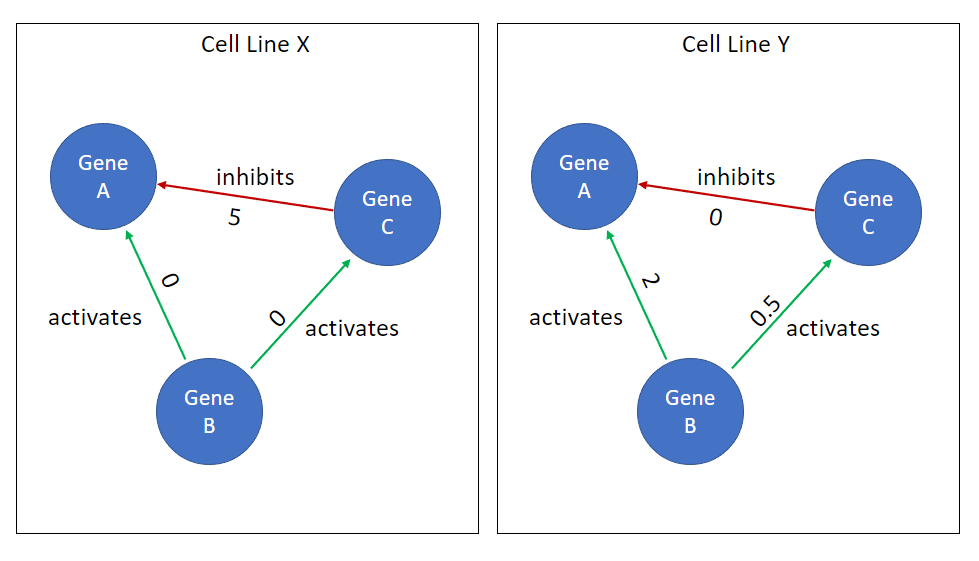

# Contextual protein-protein trainable edge weights 

As we've mentioned previously, we recognize that using a shared gene-regulatory network (GRN) or protein-protein interaction (PPI) graph will result in `contextually` false edges. This is due to the fact that no individual cell type participates in *all* PPIs. Rather, each celltype has a unique set of PPIs (and likely GRN); However, we are limited in that we do not know cell-type specific GRNs or PPI graphs and therefore have introduced `contextual protein-protein trainable edge weights`. 

In practice, this is implemented by a linear layer (weight + bias) such that our `context` features (In synthetic data, this is a one-hot encoded vector specifying the cell model (e.g., "cell line" analog)) selects a unique set of edge weights. ~~We then pass the edge weights into a sigmoid function to scale the edge features between 0,1.~~ 

Our expectation is that our model will be able to learn which edges do not exist (or differences in edge flux), and thereby significantly improve performance **and** predict cell line differences in drug response. We rationalize that including the bias term in this mechanism will allow the model to distinguish edges that do not exist for *all* cell lines (a.k.a., true false edges). 

> **Figure 1**: Simple depiction of how two cell lines or cell types (X,Y) can have a unique set of edge weights, which we expect to allow for cell type specific drug response. 

However, one potential challenge to this approach is *overfitting* due to high model complexity. As our PPI network grows, so does the number of trainable edge weights we must include and this makes up a significant proportion of the model's overall trainable edge weights. The number of PPI trainable edge weights (n) scale as: 

$$ n = F*E*(C + 1) $$ 

Where $F$ is the number of features per edge, $E$ is the number of edges, and $C$ is the number of cell lines in the model. 

A practical example: when initializing a model to predict outputs on the Ecoli GRN (1556 nodes) synthetic data, with 10 "cell line" models and 1 feature per PPI edge, there are `88,352` PPI edge features and this makes up ~95% of the total model parameters. 

One assumption we've made for this problem is that the majority of PPI edges are shared across all cell-lines/cell-types and that perhaps 5-10% of the edges differ. As such, we expect useful PPI edge features to be sparse. We considered using an approximate bayesian method, such as variational autoencoder or categorical variables such as the `softmax-gumbel` method, which would allow us to specify priors on the sparsity of our features; however, for simplicity we opted to use a strong `L2` penalty on the PPI contextual edge features. 

This PPI penalty can be specified using the `edge_wd` parameter in the `settings.ini` file and the PPI edges L2 norm can be retrieved using `gnn_cdr.model.GNNCDR.get_ppi_edge_l2()`. 