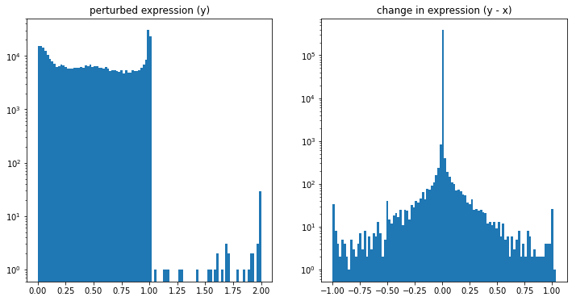
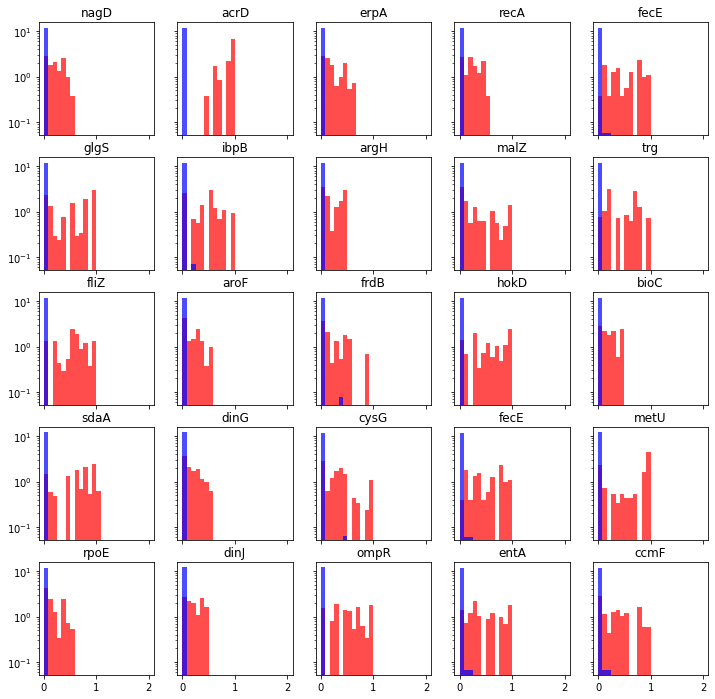

# The Choice of Target (Endogenous feature)

We have two options for our choice of endogenous feature: 

    1. Absolute `perturbed expression` 
    2. Change in `perturbed expression`  

Assuming we have an accurate baseline (e.g., unperturbed-expression) we should be able to convert between either endogenous variable. Arguably, `absolute pertubed expression` is more convenient and useful; however, there are two challenges with predicting `absolute perturbed expression`.

    1. The distribution of targets are not centered or scaled, which could induce training issues (See figure 1).
    2. In any given observation, the grand majority of genes do not have significant change in expression. As such, the baseline (unperturbed) expression predicts the endogenous variable very well, and we call this the `naive` prediction - which we often use as a baseline. **When we use the Ecoli gene regulatory network (GRN) to produce synthetic data (1556 genes), our `naive` multi-output values are: 

> uniform weighted R2: ~0.95
> variance weighted R2: ~0.99

(R2 score between `absolute perturbed expression` and x is `absolute unperturbed expression) 

The interpretation of this is that almost all the variance is explained by cell to cell variance, rather than by perturbed expression changes. 

There are a number of factors that contribute to this behavior in our synthetic data: 

    1. A lack of noise (optional)
    2. Observations can range from time=0 (e.g., baseline) to time=500
    3. Genetic perturbations only have a single gene target - therefore downstream changes may be minimal 
    4. Chemical perturbations have a range of concentrations - small concentrations may create a minimal change in expression. 

> **Figure 1:** A random subset of the Synthetic data generated from the full Ecoli gene regulatory network with 1556 gene nodes. No noise was added to this synthetic data. (left) The absolute value of perturbed expression. Note that the data is between 0,2 and the y-axis is log scaled. Normally, GeneNetWeaver produces data between 0-1; however, our method of simulating chemical perturbations occasionally produces values greater than 1. (right) The change in expression as calcuated by `absolute perturbed expression - absolute unperturbed expression`. 

> **Figure 2**: A random subset of the Synthetic data generated from the full Ecoli gene regulatory network with 1556 gene nodes. No noise was added to this synthetic data. Here we have plotted the `absolute perturbed expression` (red) and the `change in expression`. Note that the `change in perturbed expression` is *almost* always zero.  

> **For these reasons, we have chosen to use the `change in pertubed expression` as our endogenous variable. 