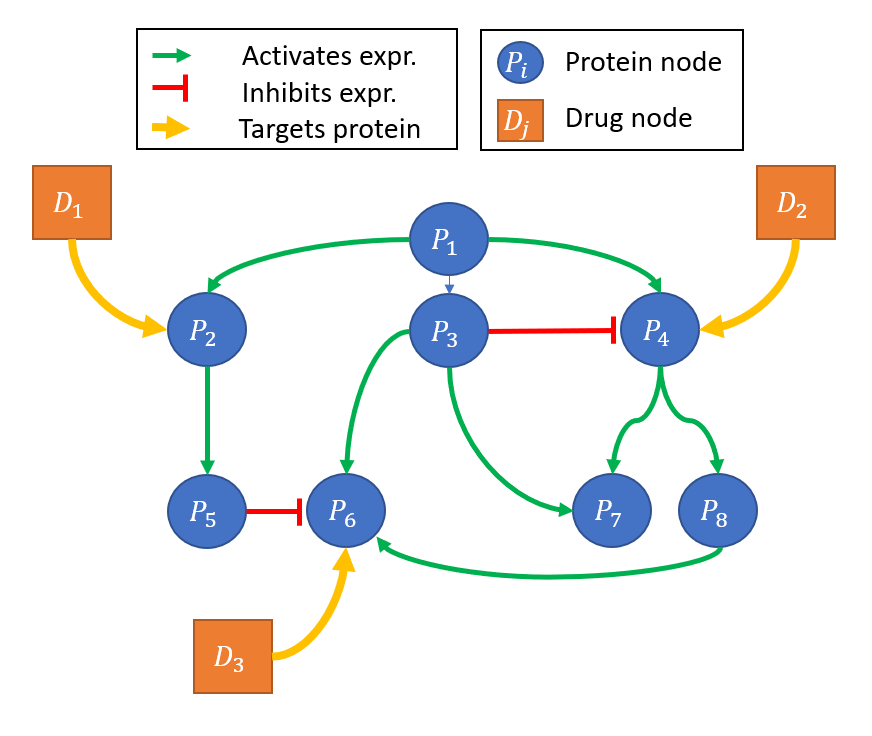
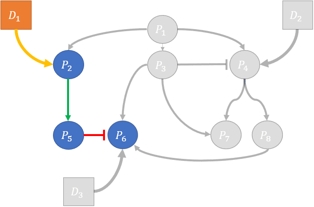

# Gene Regulatory Networks (GRN) 

We can define transcriptional machinery by using graphical models called `gene regulatory networks` (GRN). GRNs are directed graphs that link either `proteins -> proteins` or `proteins -> Transcription Factors (TF)` or `TFs -> Proteins`. Edge types can be categorized by the type of interaction, for instance: 

- physical binding between two proteins 
- expression activation between a TF and a protein 
- expression inhibition between a TF and a protein 

Image [source](https://en.wikipedia.org/wiki/Gene_regulatory_network). 

# Drug-Target Interactions (DTI)

The pharmacological model of ligand binding applies to most small molecules used in targeted therapies. In this model we conceptualize a given drug binding to one or more proteins with specificity and varying levels of affinity. The drug presence changes protein structure in a way that modifies the protein's behavior or interactions with other cellular components. 

# Drug or genetic perturbation assays 

There are several assays available that measure the gene expression (mRNA or protein) of a cell line before and after exposure to a given perturbagen. These assays have been performed extensively to provide large datasets characterizing the transcriptional and proteomic response to millions of perturbagens (both chemical or genetic). These datasets can, in general be though of as having 3 main components: 

- unperturbed gene expression (no drug present)
- perturbed gene expression, measured at time ($t$) 
- time ($t$) after introduction of a pertubagen that the gene expression was measured. 

# Incorporating GRNs, DTI and perturbation assays in a single framework 

Gene Regulatory Networks and Drug Target Interactions can be encoded in a heterogenous graph, with nodes consisting of proteins and pertubagens, a simple version of this is visualized in the figure below. Edges may characterize PPI interactions (expression regulation, binding, etc.) or characterize relationships between drugs and proteins (drug targets). 

Considering the dimensionality and complexity of the human interactome, this network in practice would become quite massive: 

- 20,000+ proteins nodes
- 1000-100000 perturbagen nodes 

However, in this model of pertubation - we can further divide individual pertubations into subgraphs that contain only descendents of a single or set of pertubations. See the figure below for an example of individual pertubation subgraphs: 

# Predicting perturbed expression using Graph Neural Networks (GNN)

Using these perturbation subgraphs as a framework, we can formulate the prediction of perturbed expression as a `node regression` task. Node features could be overlaid to characterize the specifics of a given experiment - for instance:

- the concentration of a drug
- a given cell lines genomic or transcriptional properties 
- node properties: 
    - (drug) chemical SMILES or chemical properies 
    - (protein) protein amino acid sequence 

Global features of the graph might include: 

- tissue type 
- auxillary experimental conditions (DMSO conc., growth hormones, protocol)
- total drug concentration 

Edge Features might include: 

- flux or confidence of a PPI edge 
- interaction type 
- binding affinity information of a drug-protein edge 

The **dependant variable (y)** that our model will predict is the perturbed expression of a given protein node.

To effectively learn a function that maps our heterogenous graph and node features to node prediction we suggest using a `Graph Neural Network` (GNN). 

# Cell Context Considerations 

It is well understood that GRNs vary significantly from tissue to tissue and between cell types. This highlights a need to either: 

    A) `Learn context specific edges`   
    B) `Provide context specfic input graphs`   
    C) Learn GNN functions that can mediate context specific behavior based on contextual node features.   

Additionally, individual proteins may also have contextually specific features - such as the production and degredation rates of a protein. One standing question is, what features might be predictive of such protein-specific features? Or do we need to learn these features directly from the perturbation data? 

