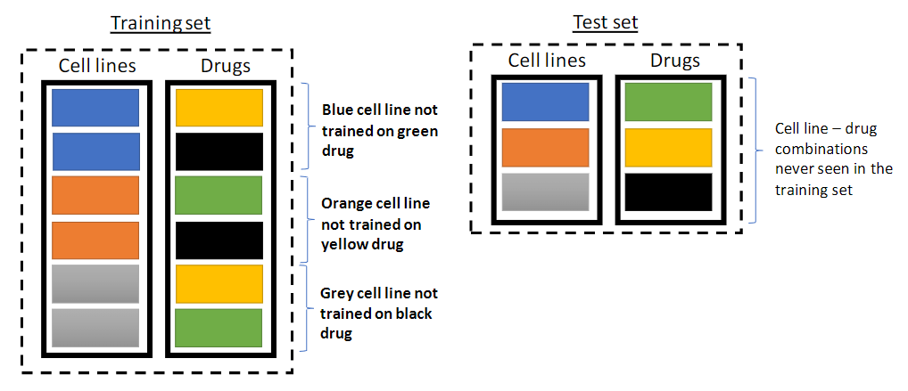

# Creating the Train-Test-Validation datasets 

We will create three datasets, 

1. `train`: ALL genetic perturbations + a proportion of single agents  
2. `test`: a proportion of single agent data
3. `validation`: This will be combination data only.

# Single-agent Datasets

The `Train` and `Test` splits will only have single-agent perturbations. Since our model attempts to learn drug-specific parameters (binding affinity information) we can not exculde a drug entirely for the training dataset. Instead, we will group observations by `cell-line` + `drug` pairs and separate them into *either* train or test datasets. This allows us to train drug-specific parameters while still testing on unseen cell-line responses. This procedure is illustrated in figure 1. 

# Combination-agent Dataset

The validation set will include only chemical combination-agent data. Performance on this data subset is the ultimate goal of our project. 